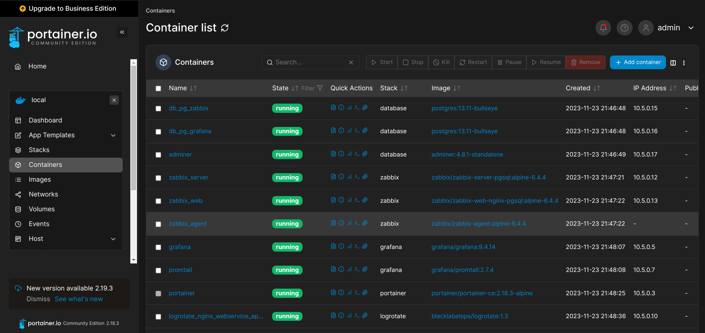
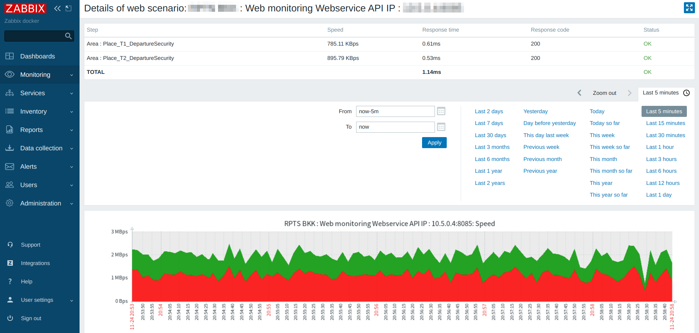
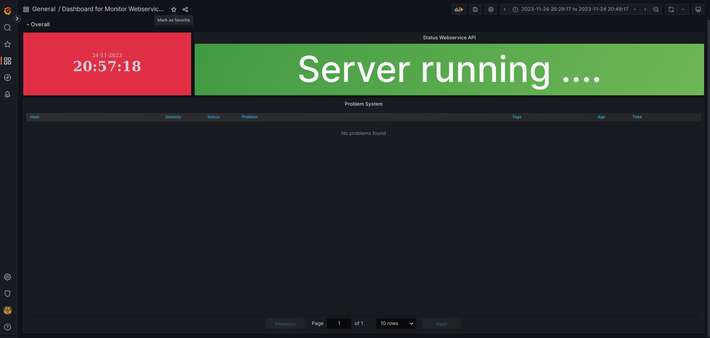
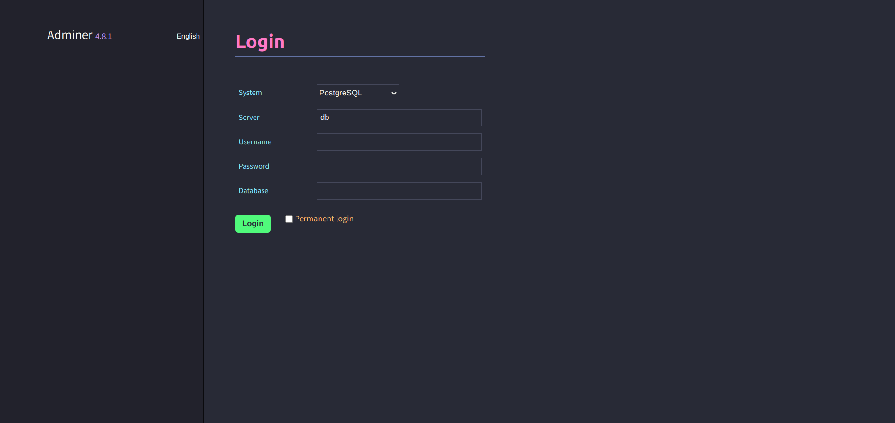

# webserviceAPI-golang-nginx-zabbix-grafana-docker

- เป็นระบบ WebserviceAPI ที่พัฒนาด้วย Golang โดยใช้ Go web framework ที่ชื่อว่า Fiber
- โดยระบบ WebserviceAPI ใช้ Nginx ในทำการ Webserver ,reverse proxy
- มี software ที่ช่วย monitoring WebserviceAPI เช่น zabbix ,grafana
- มี software ที่ช่วย backup filelog เช่น logrotate linux
- ใช้ฐานข้อมูล PostgreSQL และใช้ DBMS เช่น adminer สำหรับการบริหารจัดการฐานข้อมูล
- โดยระบบทั้งหมด deploy บน virtualization technology คือ Docker

## Tech Stack in Project 

- **Language**
    - golang
- **Virtualization Technology**
    - docker
- **Software Development**
    - zabbix
    - grafana
    - portainer
    - nginx
    - logrotate
- **Database**
    - postgresql
- **Database Management System**
    - adminer
- **Web Application Firewall**
    - modsecurity
- **Other**
    - loki 
    - promtail

## Get Started
1. install Docker
- [Installation Docker](https://docs.docker.com/engine/install/)

2. install project with Shell script for Linux

```bash
  cd webserviceAPI-golang-nginx-zabbix-grafana-docker
  cd sh
  su
  Password: <password admin>
  ./install.sh 
```
3. if you want to connect zabbix with Grafana then follow this steps
- [Integrating Zabbix with Grafana](https://linuxhint.com/integrating-zabbix-grafana/)

## Screenshots





## Used By
[](https://github.com/TopThiraphat)

## Support Me
[](https://ko-fi.com/R5R0RDJVK)


