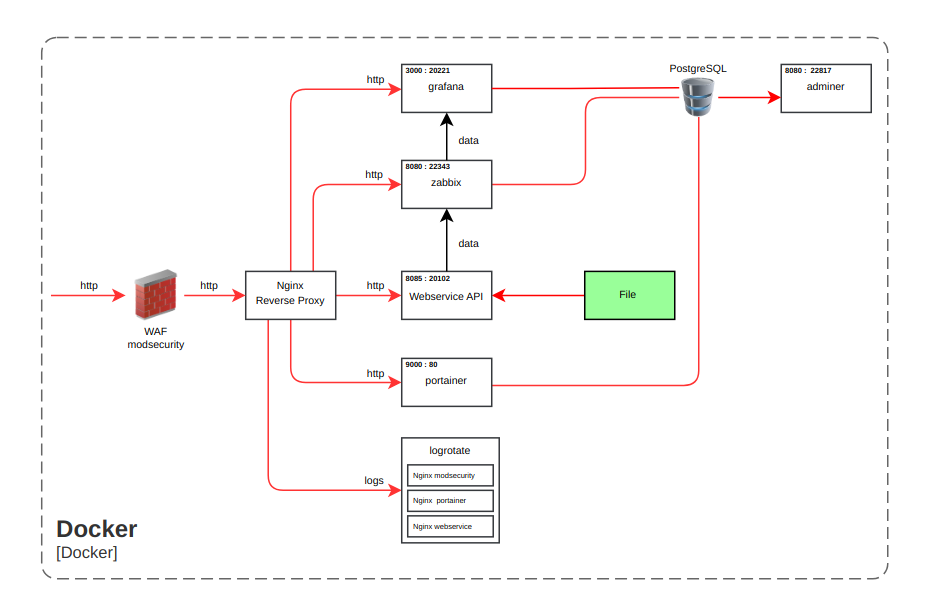

# webserviceAPI-golang-nginx-zabbix-grafana-docker

- เป็นระบบ Webservice API ที่พัฒนาด้วย Golang โดยใช้ Go web framework ที่ชื่อว่า Fiber
- โดยระบบ Webservice API ใช้ Nginx ในทำการ Webserver, Reverse Proxy
- มี Software ที่ช่วย Monitoring Webservice API เช่น Zabbix, Grafana
- มี Software ที่ช่วย Backup File log เช่น Logrotate Linux
- มี Software ที่ช่วยจัดการ Container ของ Docker เช่น Portainer
- ระบบสามารถแจ้งเตือนผ่าน Line Notify โดยผ่าน Software Monitoring Zabbix
- ใช้ฐานข้อมูล PostgreSQL และใช้ DBMS เช่น Adminer สำหรับการบริหารจัดการฐานข้อมูล
- โดยระบบทั้งหมด Deploy บน Virtualization Technology คือ Docker

## Tech Stack in Project 

- **Language**
    - Golang
- **Virtualization Technology**
    - Docker
- **Software Development**
    - Zabbix
    - Grafana
    - Portainer
    - Nginx
    - Logrotate
- **Database**
    - PostgreSQL
- **Database Management System**
    - Adminer
- **Web Application Firewall**
    - Modsecurity
- **Other**
    - Loki 
    - Promtail

ตัวอย่าง : FlowChart ของระบบ



## Get Started
1. install Docker
- [Installation Docker](https://docs.docker.com/engine/install/)

2. install project with Shell script for Linux

```bash
  cd webserviceAPI-golang-nginx-zabbix-grafana-docker
  cd sh
  su
  Password: <password admin>
  ./install.sh 
```
3. if you want to connect zabbix with Grafana then follow this steps
- [Integrating Zabbix with Grafana](https://linuxhint.com/integrating-zabbix-grafana/)

## Screenshots

ตัวอย่าง : หน้า Dashboard ของ Portainer ที่ช่วยจัดการ Container ของ Docker


ตัวอย่าง : หน้า Dashboard ของ Zabbix ที่ช่วย Monitoring Webservice API


ตัวอย่าง : Line Notify แจ้งเตือน โดยผ่าน Software Monitoring Zabbix


ตัวอย่าง : Source Code สำหรับ Script Line Notify ที่ใส่ใน Config Software Monitoring Zabbix
```javascript
  try {
    var params = JSON.parse(value);
    var response,
    request = new HttpRequest();
        if (typeof params.HTTPProxy === 'string' && params.HTTPProxy.trim() !== '') {
                request.setProxy(params.HTTPProxy);
        }
    request.addHeader('Content-Type: application/x-www-form-urlencoded');
    request.addHeader('Authorization: Bearer ' + params.To);
    var message = params.Subject+'\n'+params.Message;
    response = request.post('https://notify-api.line.me/api/notify', 'message='+encodeURIComponent(message));
        if (request.getStatus() !== 200) {
        throw response;
        }
    } catch (error) {
            response = error;
    }
    return JSON.stringify(response);
```

ตัวอย่าง : หน้า Dashboard ของ Grafana ที่ช่วย Monitoring Webservice API


ตัวอย่าง : หน้า Adminer สำหรับการบริหารจัดการฐานข้อมูล


## Used By
[](https://github.com/TopThiraphat)

## Support Me
[](https://ko-fi.com/R5R0RDJVK)


